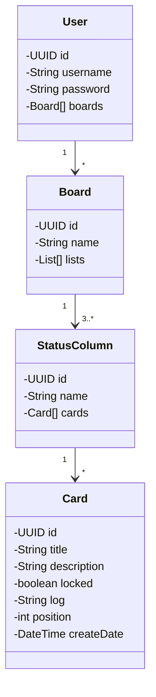

```mermaid

classDiagram

    class User {
        -UUID id
        -String username
        -String password
        -Board[] boards
    }

    class Board {
        -UUID id
        -String name
        -List[] lists
    }

    class StatusColumn {
        -UUID id
        -String name
        -Card[] cards
    }

    class Card {
        -UUID id
        -String title
        -String description
        -boolean locked
        -String log
        -int position
        -DateTime createDate
    }

    User "1" --> "*" Board
    Board "1" --> "3..*" StatusColumn 
    StatusColumn "1" --> "*" Card
```
